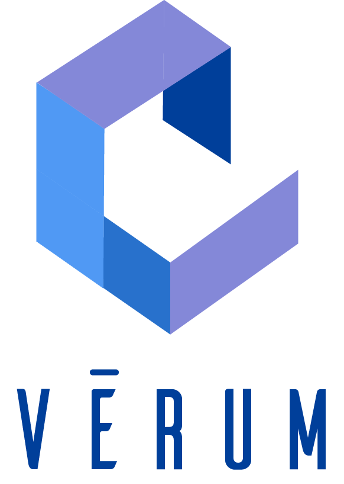
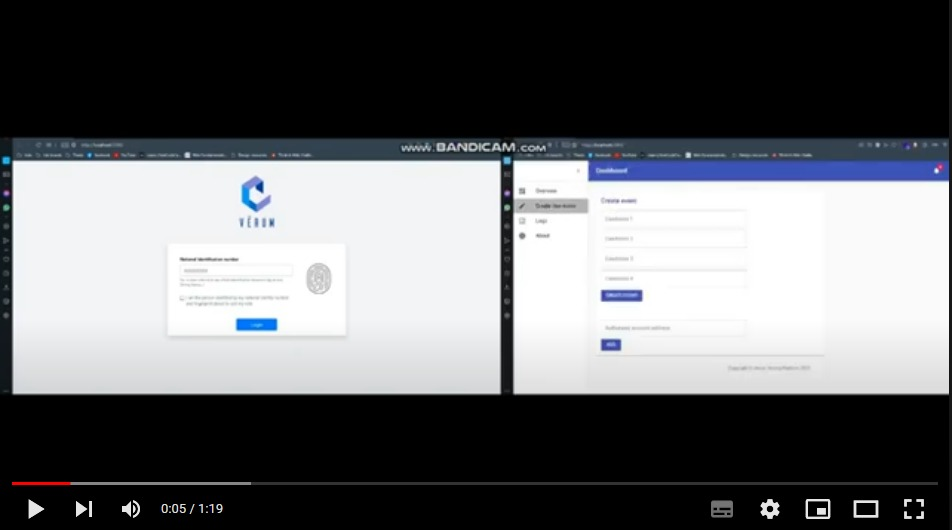
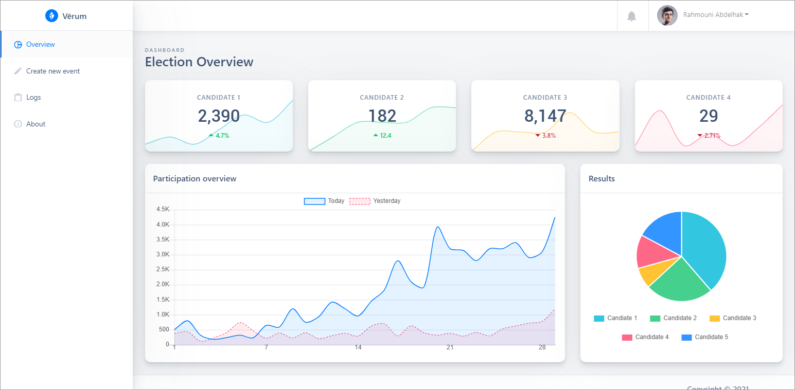
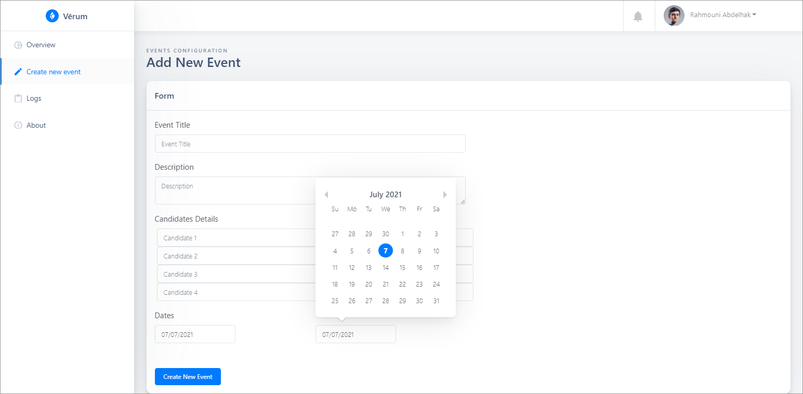
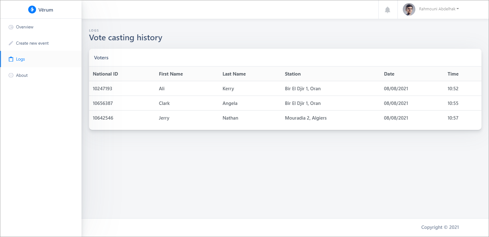
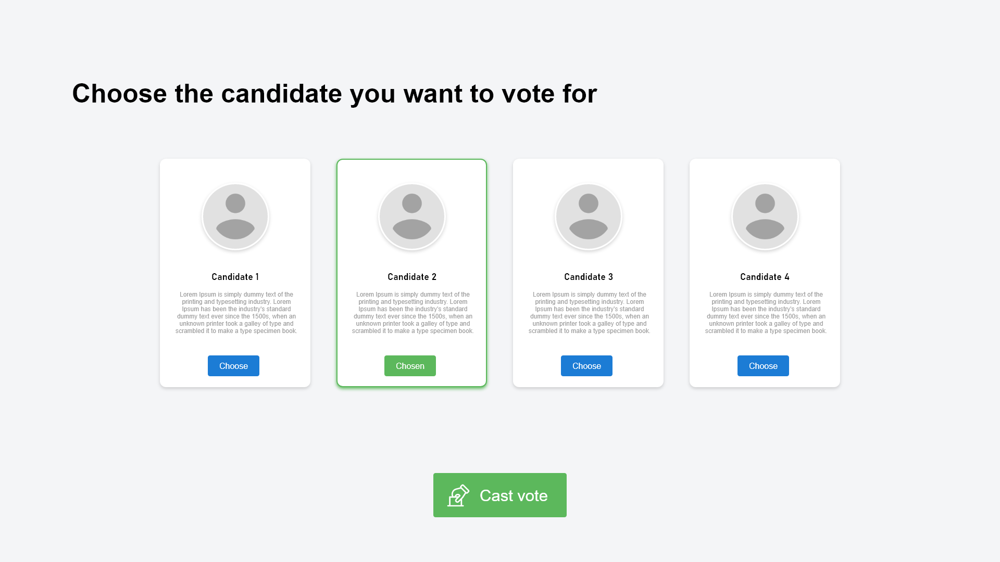
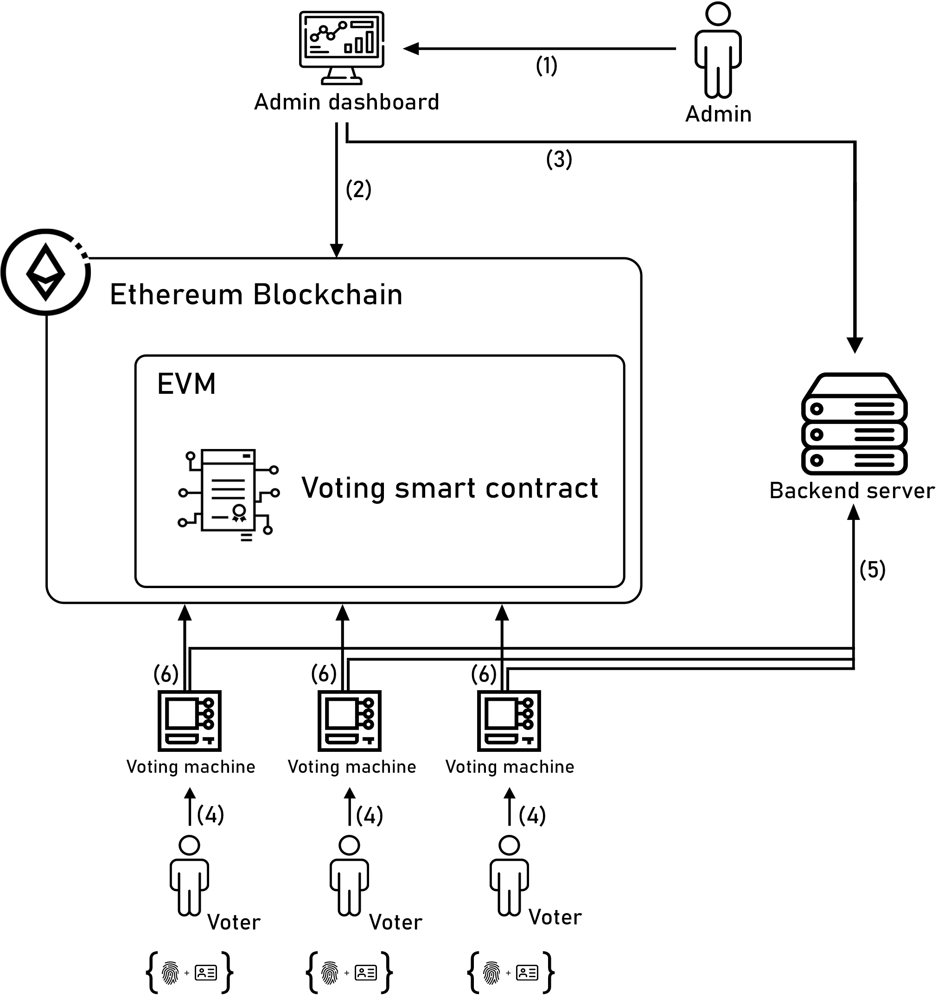
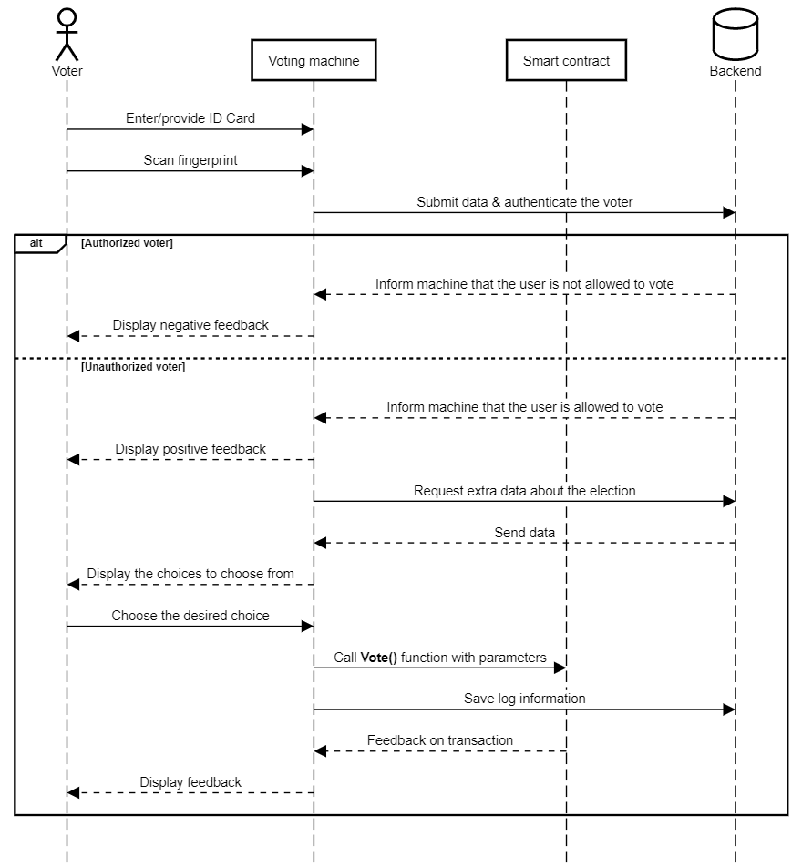
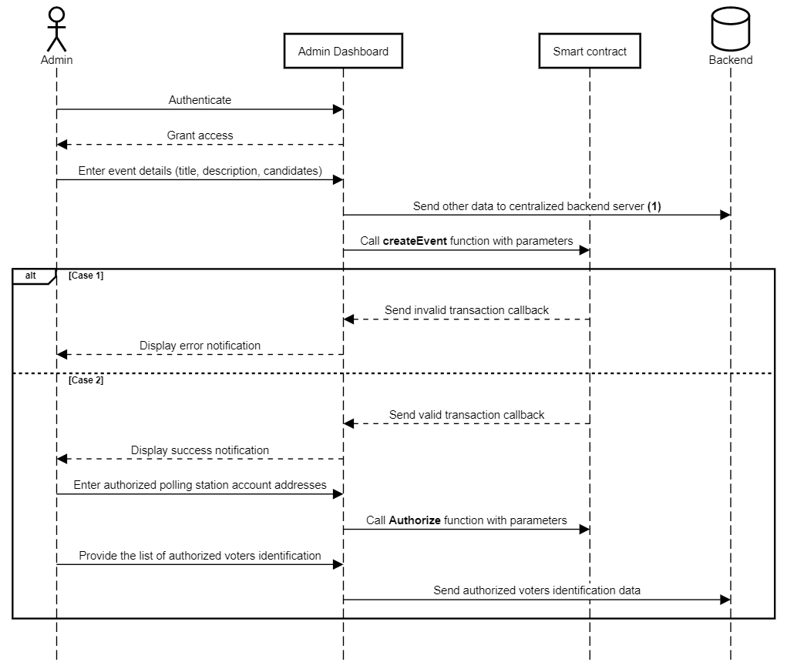

# Verum: A decentralized electronic voting system based on Blockchain technology

JavaScript ● React ● HTML ● CSS ● Ethereum ● Truffle Ganache ● Git ● Bootstrap ● Material UI ● MetaMask ● Photoshop ● LaTeX ● Solidity ● VS Code ● Web3 API ● Yarn ● Remix

## Introduction
Since the dawn of democracy, elections have been accused for the lack of transparency and security. As societies all over the world are rapidly adopting technology across all aspects of society, a digitalized democratic system of voting might just be the next evolutionary step towards a transparent and trusted electoral system.

## Purpose
The goal of this work is to investigate the possibility of using the new surging Blockchain technology as the underlying technology powering an electronic voting system, offering the ability to store the results in a decentralized ledger that should grant the solution attributes like immutability and transparency. We intend to achieve our goal by designing a decentralized e-voting system as a Proof-of-concept, capable of launching an election, casting votes and displaying results, all while ensuring transparency, anonymity, security and above all correctness of the results.

    
    
<b>Figure 1:</b> Proof-of-concept ”Verum” Logo

## Demo

    
    
<b>Figure 2:</b> Quick demo video

## Screenshots

    
    
    
    
<b>Figure 3:</b> Admin dashboard screenshots

    
    
    
<b>Figure 4:</b> Voter application screenshots

## System design

We introduce our proposed voting system that aims to solve some of the barriers that traditional voting systems have. Also, remedy some of the shortcomings we perceived in similar proposed works.

    
    
<b>Figure 5:</b> High level architecture of the proposed system and the interaction between
its components

### System components
_**a.) Admin dashboard:**_ The dashboard application provides the administrative authority with an interface to interact with both the smart contract and the backend server. This component is responsible for managing voting events. The administrative authority fills-in the event’s title, description along with candidates information and the addresses of Ethereum accounts that are authorized to cast a vote. The most critical information provided being the candidates’ names and assigned ids are stored on the Blockchain, whereas less critical information like candidates’ descriptions and media files are stored on the centralized server.

_**b.) Voting machine:**_ Each polling station is equipped with machines that
contain an Ethereum wallet and run the voting application. These machines are preferably equipped with touchscreen capabilities allowing the voters ease of use. Authorized voters have physical access to these machines and are required to authenticate using biometric means (ID Card & fingerprint). The application running on these machines retrieves and sends data from both the Ethereum network and the backend servers. What is retrieved from the Ethereum network is the candidates’ names and what is sent is the id of the chosen candidate, and for the backend, the application retrieves media files and additional data used for better graphic display and it sends log information to the backend.

_**c.) Backend server:**_ This component is complementary by design. The main responsibilities of this component are to ensure secure authentication of voters, the storing and supply of complementary data to both the admin dashboard application and the voter application.

_**d.) Smart contract:**_ Our voting smart contract (see figure ??) is deployed once for all voting event. The contract is responsible for writing into the Blockchain (state variables) through the various functions we defined. Both the voter application and the admin application interact with the same contract, however, only the administrative authority using the admin account has the ability to create a voting event or grant voting privileges to other accounts.

### Components interactions
**(1)** The admin operating the dashboard launches and monitors voting events

**(2)** Essential data (candidates name and id, event title, start & finish dates) are saved in the Blockchain along with the list of authorized accounts that can interact with the smart contract.

**(3)** Secondary data that is of less importance is saved to the regular (centralized) backend server.

**(4)** Voters authenticate themselves to the polling machines (using biometric means) and cast their vote for a candidate of their choosing.

**(5)** Voting machines use the backend server to verify the identity of the voter and to fetch secondary data required for the displaying of candidates.

**(6)** Voting machines save the submitted choice to the Blockchain by launching a transaction that increments the vote count of the chosen candidate.

### Diagrams
we further showcase how the different components of our system interact with each other using sequence diagrams and their additional description.

#### Voting event creation diagram

    
    
<b>Figure 6:</b> Sequence diagram of the process of creating and launching a new voting event

#### Vote casting diagram

    
    
<b>Figure 7:</b> Sequence diagram of the process of casting a vote

<h2>Work in progress</h2>
